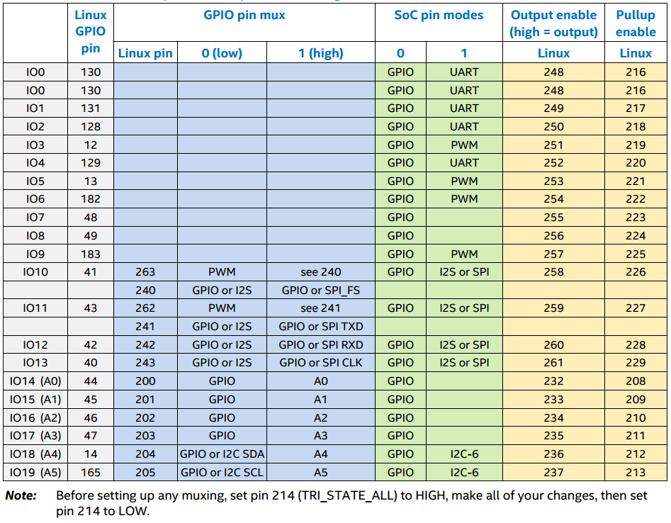

Pin Multiplexor
==

Owner: Lynette


Suggested outline:

* What is pin multiplexing?

* How to configure the muxing
    * How to Mux?
    * Lets MUX-it!
    * Exercise: use a pin for PWM, configure it, and measureit is send the correct voltage according to the PWM configuration. Using a multimeter or a DC motor.

* Try to apply the knowledge acquired to a small part of a bigger problem, probably ask the participant to plan the pin configuration he is going to need for the  training project.


------------------------------------------------------------------------------------------------------
# What is pin multiplexing?
Some pins on the Intel® Edison may be configured with one well-defined purpose, others  are able to support  variety of functions including general-purpose I/O(GPIO), I2C, PWM, SPI , ADC among others.

**Pin multiplexing** is the process of  selecting  a  specific function  for a particular multi-function shield pin. 

However in some cases it can do more that just select the function. Other options for the pin include connecting  to pull-up or pull-down resistors to bias a line to a specific value. Some pins can be configured to detect input signal changes and generate an interrupt or a wakeup event.

# Watching it change (a primer on GPIO and GPIO configuration this content is moving to GPIO Subsystem)

To see the status of our exported pins in the Edison, type this your Edison's terminal:

```
root@edison:/# watch -n 1 cat /sys/kernel/debug/gpio
```
Basically, it will output the configured GPIO's to console every second:

```
Every 1s: cat /sys/kernel/debug/gpio                        2015-10-13 21:02:27

GPIOs 0-191, pci/0000:00:0c.0, 0000:00:0c.0:
 gpio-61  (SW1UI4              ) in  hi
 gpio-64  (bcm43xx_irq         ) in  hi
 gpio-71  (bcm_bt_lpm          ) out lo
 gpio-77  (sd_cd               ) in  hi
 gpio-96  (vwlan               ) out hi
 gpio-111 (Arduino Shield SS   ) out hi
 gpio-124 (hsu                 ) in  hi
 gpio-125 (hsu                 ) in  hi
 gpio-126 (hsu                 ) in  hi
 gpio-127 (hsu                 ) in  hi
 gpio-128 (hsu                 ) in  hi
 gpio-129 (hsu                 ) in  hi
 gpio-130 (hsu                 ) in  hi
 gpio-131 (hsu                 ) in  hi
 gpio-132 (hsu                 ) in  lo
 gpio-133 (hsu                 ) out lo
 gpio-134 (hsu                 ) in  hi
 gpio-184 (bcm_bt_lpm          ) out lo
 gpio-185 (bcm_bt_lpm          ) in  lo

GPIOs 200-215, i2c/1-0020, pcal9555a, can sleep:
 gpio-207 (sysfs               ) in  hi
 gpio-215 (sysfs               ) out lo

GPIOs 216-231, i2c/1-0021, pcal9555a, can sleep:

GPIOs 232-247, i2c/1-0022, pcal9555a, can sleep:

GPIOs 248-263, i2c/1-0023, pcal9555a, can sleep:

```
The gpio's displayed above, are the ones reserved (AKA exported) by default in a newly flashed  yocto image **Poky (Yocto Project Reference Distro) 1.7.2 edison**,  kernel  **3.10.17-poky-edison+**

To reserve and use a GPIO, 
Before:
```
root@edison:~# ls /sys/class/gpio
export       gpio127      gpio131      gpio207        gpiochip216
gpio124      gpio128      gpio132      gpio215        gpiochip232
gpio125      gpio129      gpio133      gpiochip0      gpiochip248
gpio126      gpio130      gpio134      gpiochip200    unexport
```

let's say 48 lets type the following:
```
root@edison:/# echo 48 > /sys/class/gpio/export
```

by this mechanism, a new directory is created in **/sys/class/gpio**, which should be **gpio48**:
After:
```
root@edison:/# ls sys/class/gpio/
export       gpio127      gpio131      gpio207      gpiochip200  unexport
gpio124      gpio128      gpio132      gpio215      gpiochip216
gpio125      gpio129      gpio133      gpio48       gpiochip232
gpio126      gpio130      gpio134      gpiochip0    gpiochip248

```
this directory, is a control interface used to get userspace control over GPIO48, therefore can have the following read/write attributes:


	"direction" ... reads as either "in" or "out". This value may
		normally be written. Writing as "out" defaults to
		initializing the value as low. To ensure glitch free
		operation, values "low" and "high" may be written to
		configure the GPIO as an output with that initial value.

		Note that this attribute *will not exist* if the kernel
		doesn't support changing the direction of a GPIO, or
		it was exported by kernel code that didn't explicitly
		allow userspace to reconfigure this GPIO's direction.

	"value" ... reads as either 0 (low) or 1 (high). If the GPIO
		is configured as an output, this value may be written;
		any nonzero value is treated as high.

		If the pin can be configured as interrupt-generating interrupt
		and if it has been configured to generate interrupts (see the
		description of "edge"), you can poll(2) on that file and
		poll(2) will return whenever the interrupt was triggered. If
		you use poll(2), set the events POLLPRI and POLLERR. If you
		use select(2), set the file descriptor in exceptfds. After
		poll(2) returns, either lseek(2) to the beginning of the sysfs
		file and read the new value or close the file and re-open it
		to read the value.

	"edge" ... reads as either "none", "rising", "falling", or
		"both". Write these strings to select the signal edge(s)
		that will make poll(2) on the "value" file return.

		This file exists only if the pin can be configured as an
		interrupt generating input pin.

	"active_low" ... reads as either 0 (false) or 1 (true). Write
		any nonzero value to invert the value attribute both
		for reading and writing. Existing and subsequent
		poll(2) support configuration via the edge attribute
		for "rising" and "falling" edges will follow this
		setting.


#Exercise1: Change GPIO direction
As explained before the GPIO control interface has some read/write attributes, so lets go ahead and change the default direction of the **GPIO48**.

1. Review the current GPIO direction using the command  to debug GPIO statuses; If the direction is **"out"** let's change it to **"in"**, if it is **"in"**, change it to **"out"**

2. To change it, from **"in"** to  **"out "** we only have to  write "out" to attribute **GPIO48/direction** like this:

```
echo out > /sys/class/gpio/gpio48/direction
```

Then checking again the GPIO status we can see, that direction has changed. Here is a table that shows the direction before and after the change: 

| GPIO48  Previous Direction | GPIO48  New Direction |
| -- | -- |
| gpio-48  (sysfs               ) **in**  lo| gpio-48  (sysfs               ) **out**  lo |


#How to MUX?

All GPIO pins on the Arduino* header require some internal GPIOs to be set up before the pin is usable. This is
usually as simple as setting an output enable, pullup enable, and mode. However, some pins have extra
functionality such as SPI, PWM, or I2C, so these pins need extra multiplexing (muxing) in order to be usable.
Table 1 shows this such that a programmer can easily see all the muxing pins affected for a given Arduino* header
pin. The color codes in the table show related boxes. For example, the blue boxes are meant to show the
relationship between the pin mux pins and the pin modes. ~~This table is a synopsis of the more detailed tables
below, which contain extra information, such as schematic pin numbers. For most needs, this synopsized table
should suffice.~~


######Table1 Arduino* pin mux and pin mode settings 



#Lets MUX-it!


##links
* [Kernel GPIO documentation](https://www.kernel.org/doc/Documentation/gpio/sysfs.txt)
* [Edison-Arduino GPIO mapping](http://www.intel.com/support/edison/sb/CS-035275.htm)

## Links

- [Intel® Edison GPIO Pin Multiplexing Guide](http://www.emutexlabs.com/project/215-intel-edison-gpio-pin-multiplexing-guide)
- [Intel® Edison Connector Pinout](http://akizukidenshi.com/download/ds/intel/edison-module_HG_331189-002.pdf)
- Link Not Available [Arduino Board Schematic](http://www.intel.com/support/edison/sb/CS-035272.htm)
- Is this the correct one for Arduino Board Schematic? [Arduino Board Schematic](http://download.intel.com/support/edison/sb/edison_arduino_hvm_8_26.pdf)
- [MRAA Library Physical pins map to MRAA pin numbers](http://iotdk.intel.com/docs/mraa/v0.6.0/edison.html)
- [Github User TaipeiHackerSpace / Edison](https://github.com/taipeihackerspace/mredison/blob/33f6a61e474fae87c7c2770282ecca7d5fe9f0c4/gpio_setup.sh)
- [Github User edouardrosset  / Edison Script for General Configuration Right After Flashing](https://github.com/edouardrosset/Edison/blob/master/Intel_Edison_postFlash.sh)
